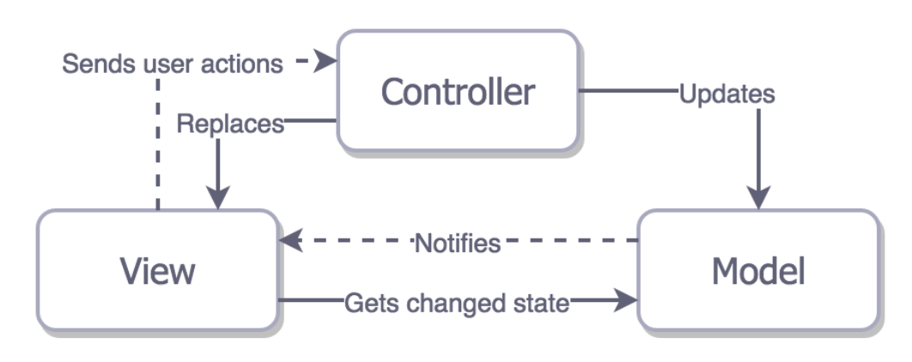

## MVC
화면으로부터 비즈니스 로직을 분리하는데 중점을 두고있다. (이를 <b>'관심사 분리' </b>라고한다.)

이를 통해 어플리케이션의 시각적 요소나 그 이면에서 실행되는 <b>비즈니스 로직</b>을 서로 영향 없이 고칠 수 있다.

- Model : 데이터와 비즈니스 로직을 관리한다. (json 같은 데이터를 받아오기 위한 <b>데이터 구조 정의</b>)
- View : 레이아웃과 화면을 처리한다. (받아온 <b>데이터 가공</b>)
- Controller : 명령을 모델과 뷰 부분으로 라우팅 한다. (가공한 데이터를 <b>보여준다.</b>)

여기서 말하는 명령은 사용자의 입력이라고 할 수 있을 거 같다.

- <b>컨트롤러</b> 는 모델에 명령을 보냄으로써 모델의 상태를 변경할 수 있다. 
컨트롤러가 관련된 뷰에 명령을 보냄으로써 모델의 표시 방법을 바꿀 수 있다.

- <b>모델</b> 은 모델의 상태에 변화가 있을 때 컨트롤러와 뷰에 이를 통보한다. 이와 같은 통보를 통해 뷰는 최신의 결과를 보여줄 수 있고, 컨트롤러는 모델의 변화에 따른 적용 가능한 명령을 추가 , 제거 , 수정할 수 있다.   
통보 대신 뷰나 컨트롤러가 직접 모델의 상태를 읽어 오기도 한다.

- <b>뷰</b> 는 사용자가 볼 결과물을 생성하기 위해 모델로부터 정보를 얻어 온다. (표시할 데이터를 모델로부터 받아온다.)

view 가 사용자의 동작을 인식하고 Model 이 바뀌면 view 에서 직방으로 model로부터 상태 정보를 받아온다.   