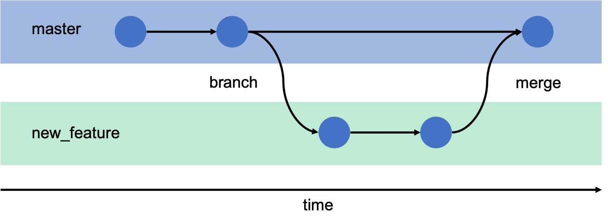

# Branch 란?
여러 개발자들이 동시에 다양한 작업을 할 수 있게 해주는 기능이다. 
각자 <b>독립적인 작업 영역(저장소)</b>에서 마음대로 소스코드를 변경할 수 있다.
이렇게 분리된 작업 영역에서 변경된 내용은 나중에 원래의 버전과 비교해서 하나의 새로운 버전으로 만들 수 있다.

브랜치란 독립적으로 어떤 작업을 진행하기 위한 개념이다. 필요에 의해 만들어진 각각의 브랜치는 다른 브랜치의 영향을 받지 않기 때문에 <b>여러 작업을 동시에 진행할 수 있다.</b>  

이렇게 만들어진 브랜치는 <b>병합(Merge)</b> 함으로써, 작업한 내용을 하나의 브랜치로 모을 수 있다.

여러 명이서 작업할 때 다른 사람의 작업에 영향을 주거나 받지 않도록, 먼저 <b>메인 브랜치</b>에서 <b>자신의 작업 전용 브랜치를 만든다.</b> 그리고 각자 작업을 진행한 후, 작업이 끝난 사람은 <b>메인 브랜치에 자신의 브랜치의 변경 사항을 적용한다.</b> 이렇게 함으로써 <b>다른 사람의 작업에 영향을 받지 않고, 독립적으로 특정 작업을 수행하고 그 결과를 하나로 모아가게 된다.</b>