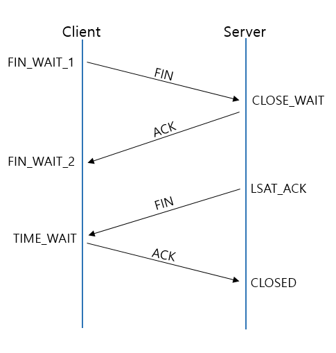

# TCP Connection (3-Way Handshake) 란?
TCP는 장치들 사이에 논리적인 접속을 성립하기 위하여 Three-Way Handshake 를 사용한다.

> 물리적인 개념이 아닌 논리적인 개념이다.

- 클라이언트가 opne() 을 사용했을 때 사용된다.  즉, 열었을 때

## 역할
- 양쪽 모두 데이터를 전송할 준비가 되었다는 것을 보장한다.
- 실제로 데이터 전달이 시작하기 전에 한쪽이 다른 한쪽이 준비되었다는 것을 알 수 있도록 한다.
- 양쪽 모두 상대편에 대한 초기 순차일련번호를 얻을 수 있도록 한다.

#### UDP 의 단점을 극복했다

    

SYN : synchronize sequence numbers   
ACK : acknowledgment

## 설명 

A -> B : 살아있어?   
B -> A : 응, 너는?   
A -> B : 나도! 

# 4-Way HandShake

- 클라이언트가 close() 를 사용했을 때 사용된다. 즉, 닫았을 때

### 주의
> - 누가 먼저 close 를 요청하는지에 따라 상태가 달라질 수 있다. 