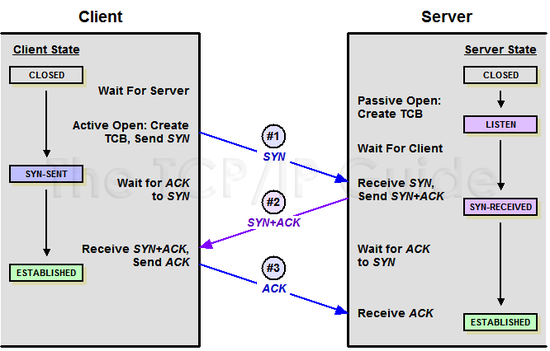

# 3-Way Handshake 란?
TCP는 장치들 사이에 논리적인 접속을 성립하기 위하여 Three-Way Handshake 를 사용한다.

- 양쪽 모두 데이터를 전송할 준비가 되었다는 것을 보장한다.
- 실제로 데이터 전달이 시작하기 전에 한쪽이 다른 한쪽이 준비되었다는 것을 알 수 있도록 한다.
- 양쪽 모두 상대편에 대한 초기 순차일련번호를 얻을 수 있도록 한다.

