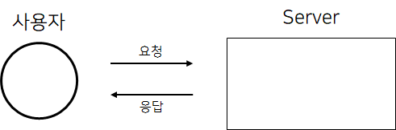

# HTTP 통신

HTTP(HyperText Transfer Protocol) 란 <b>HTML 파일을 전송하는 프로토콜이라는 의미를 갖는다.</b>

웹브라우저에서 통신이 일어나며, 초기에는 HTML 파일을 전송하려는 목적으로 만들어졌으나 <b>현재는 JSON, Image 파일 등 또한 전송한다.</b>

<b>HTTP 통신은 클라이언트가 서버에 요청을 보내면 그 요청을 서버가 응답하는 방식으로 통신한다.
응답에는 클라이언트의 요청에 따른 결과를 반환한다.</b>

#####  클라이언트의 요구가 있을 때 서버가 응답하는 방식. 단방향 통신

> <b>실시간이 아닌, 필요한 경우에만 Server 로 접근하는 컨텐츠일 경우 HTTP 를 사용하는 것이 적합하다.</b>
