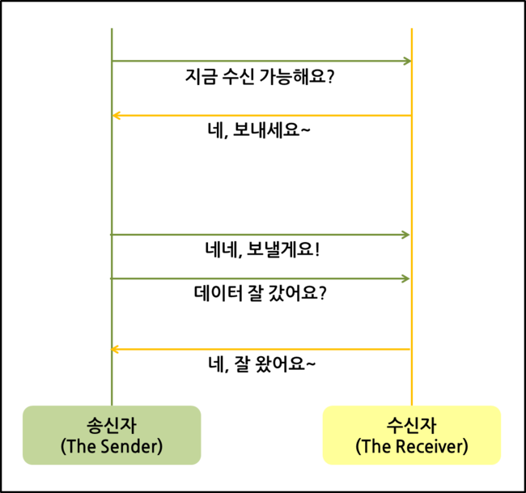

# TCP VS UDP

# TCP (Transmission Control Protocol)
TCP 는 네트워크 계층 중 전송 계층에서 사용하는 프로토콜로, 장치들 사이에서 논리적인 접속을 성립하기 위하여 연결을 사용하여 <b>신뢰성을 보장하는 연결형 서비스</b>이다.   
네트워크에 연결된 컴퓨터에서 실행되는 프로그램 간에 데이터나 메세지 등을 <b>안정적</b>으로 <b>순서대로 교환</b>할 수 있다.

<b>TCP 의 데이터 송신 과정</b>을 보자.

#### TCP 는 쌍방이다.    

# UDP (User Datagram Protocol)
UDP 는 IP를 사용하는 네트워크 안에서 컴퓨터들 간에 메시지들이 교환될 때 제한된 서비스만을 제공하는 통신 프로토콜이다. <b>UDP 는 TCP 의 대안이다.</b>

아래의 이미지는 <b>UDP 의 데이터 송신 과정</b>이다.

#### 반면에 UDP 는 일방적이라는 것을 알 수 있다.

<b>신뢰성이 요구되는 애플리케이션에는 TC</b>P 를 사용하고, <b>간단하게 데이터를 빠른 속도로 전송하고자 하는 애플리케이션에서는 UDP</b> 를 사용한다.

## 전송계층
I<b>P에 의해 전달되는 패킷의 오류를 검사하고 재전송 요구 등의 제어를 담당하는 계층이다.</b>
- TCP/IP 의 전송계층에서 사용되는 프로토콜이다.