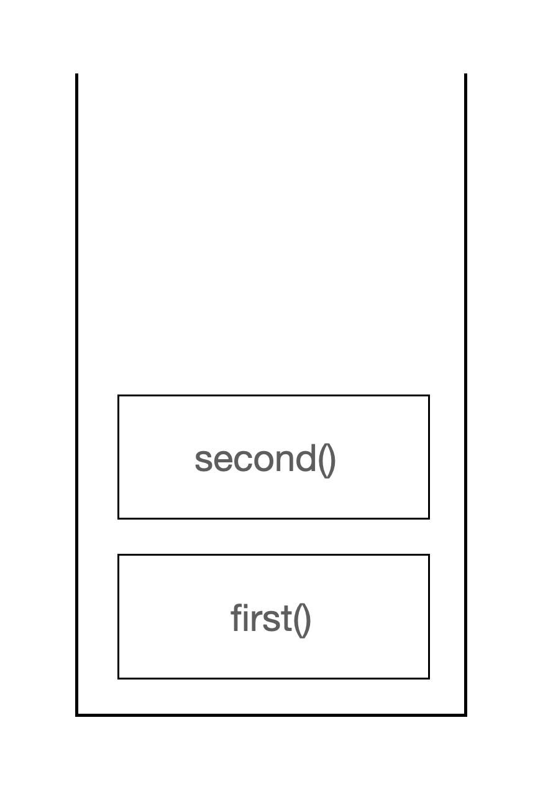

# Call Stack
실행 중인 코드를 추적하는 공간이 콜스택이다.

함수의 호출을 기록하는 스택 자료구조이다.

```swift
func first() {
    second()
    print("hi")

}
func second() {
    third()
    print("bye")
}
func third() {
    print("hi bye")
}

first()

```
출력
```swift
hi bye
bye
hi
```

### 스택에 어떻게 쌓일까?

1. first 함수가 호출된다.


first 함수가 호출되고 콜스택에 first 함수가 push 된다.


2. second 함수가 호출된다.



second 함수가 호출되고 콜스택에 second 함수가 push 된다.

3. third 함수가 호출된다.


third 함수가 호출되고 콜스택에 third 함수가 push 된다.

콜스택에 문제가 없을 경우 상단에 존재하는 함수부터 하나씩 pop 된다.(LIFO : Last In, First Out)

