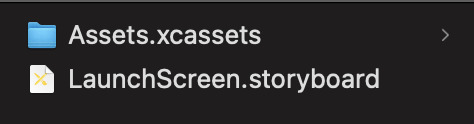

## 'AppIcon' 설정하기
1. 앱 로고 디자인을 1024 x 1024 로 한다. (실제 AppIcon 은 디자인보다 얇게 나오니 주의하기)

2. https://appicon.co/ 여기에 사진을 업로드 하고 ```Generate``` 버튼을 눌러 다운받는다.

3. 압축을 풀고 Assets.xcassets 안에 있는 AppIcon.appiconset 을 


내 프로젝트 Assets.xcassets 안에 넣는다.

넣게되면 아이콘이 모두 등록된다.