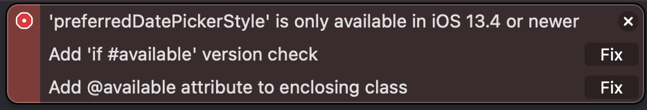

# Swift 의 Error 모음

#### Fatal error: Expected superview but found nil when attempting make constraint `equalToSuperview`.

- 추가하려는 객체를 addSubView 했는지 확인해보자.
--- 

####레이아웃이 깨지는 이슈 파악하는 방법

> Make a symbolic breakpoint at UIViewAlertForUnsatisfiableConstraints to catch this in the debugger. 

- Breakpoint 를 만든다.
    1. show the Breakpoint navigator 를 클릭한다.
    2. '+' 버튼을 누르고 Symbolic Breakpoint... 를 클릭한다.
    3. Symbol 부분에 UIViewAlertForUnsatisfiableConstraints 를 입력한다.
    4. 앱 실행 후 제약조건이 깨지는 부분으로 가서 디버깅한다.<br><br>


    이렇게 하면 Breakpoint가 깨지는 부분에서 멈춘다
    그럼 **콜스택**을 보고 확인해보면 쉽게 확인할 수 있다.


##### 콜스택이란?

[CallStack이란?](https://github.com/Mindohyeon/TIL/blob/main/Study/Call-Stack.md)

--- 

#### Version Error


#### 위와 같은 에러가 발생했을 때 어떻게 대처할까..?


1. target -> general 로 들어간다.


2. Deployment Info 에 있는 위와 같은 곳의 버전을 변경해준다.

나같은 경우 available version 이 13.4 이기 때문에 저 부분의 version 을 13.4로 변경해주면 
``` swift 
@available(iOS 13.4, *)
```
이렇게 명시적으로 선언해주지 않아도 쓸 수 있다.