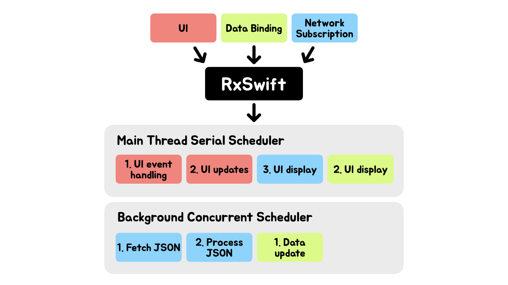

# RxSwift 란?
RxSwift(Reactive Extension Swift) 란 관찰 가능한 연속성(순차적) 형태와 함수형태의 연산자를 이용해서 비동기&이벤트를 위한 코드를 구성하고 있는 라이브러리이다.

- cocoa 코드에 결정적이고 비동기적인 방법을 이용하여 이벤트에 반응할 수 있도록 했다.

## RxSwift 를 왜 쓸까?

#### 1. <b>RxSwift 없이 비동기 처리</b>
- 비동기 실행 코드를 이해하기 힘들다 : 애플의 API 에서 제공하는 delegate 패턴을 사용할 뿐
- 비동기 실행에 관한 명확한 추론을 하기가 힘들다.

ex) 값을 예측하기 힘들다.
버튼 클릭 이벤트가 몇 번 발생했는지 모르기 때문에 buttonCnt 의 값을 코드상에서 확인하기 힘들다.

```swift
var buttonCnt = 0

func clickBtn(_ sender: UIButton) {
    buttonCnt += 1
}
```

#### 2. MVVM 과 밀접한 연관
이벤트 중심 프로그램을 위해 특별히 개발했다.
RxSwift 는 이와 연관성이 높다.


## Rx 의 3요소

#### Observable< Data >
객체에 이벤트나 값, 수정등과 같은 것을 가능하게 해준다.
- event 종류 : Next, Completed, Eror 

```swift
func fetchNews() -> Observable<[Article]> {
    return Observable.create { (observer) -> Disposable in
        
        self.fetchNews { error, articles in
            if let error = error {
                //onError - 오류가 있음을 알리고 중간에서 종류시킬 수 있는 기능, observable 구독자에게 오류 알림
                observer.onError(error)
            }
            
            if let articles = articles {
                //onNext - 구성요소를 계속 방출시킬 수 있는 기능, observable 구독자에게 데이터 전달
                observer.onNext(articles)
            }
            
            //onCompleted - 이벤트를 종료시킬 수 있는 기능, observable 구독자에게 완료되었음을 알림
            observer.onCompleted()
        }
        
        //Disposables - observer 가 필요 없어졌을 때 메모리의 할당을 지워줌
        return Disposables.create()
    }
}
```

#### Operators
observer 에서 나온 결과를 Rx연산자를 통해 입력 및 출력이 가능하다 -> side effect 가 발생할 수 있다.

- 연산자에는 기본 Swift 연산자와 같이 map, filter, range 등이 있다.


#### Schedulers
Scheduler 는 작업을 어디서 수행할지에 관한 작업을 추상화한다. Main thread 에서 수행할지, background 에서 수행할지 등을 정할 수 있게 해준다

Scheduler는 Rx에서 DispatchQueue와 동일하다. 다만 훨씬 강력하고 쓰기 쉽다.

Scheduler 를 통한 RxSwift 는 아래와 같이 동작한다.


- 예를 들어,
Network Subscription 은 Background Concurrent Scheduler 에서 먼저 Fetch Json 작업을 한 뒤, Process Json 작업을 하고 Main Thread Serial Scheduler 로 가서 UI display 작업을 한다.


#### 참고
- https://jinshine.github.io/2019/01/02/RxSwift/2.Observable%EC%9D%B4%EB%9E%80/