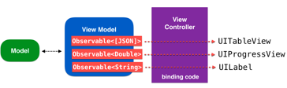

# RxSwift 란?
RxSwift(Reactive Extension Swift) 란 관찰 가능한 연속성(순차적) 형태와 함수형태의 연산자를 이용해서 비동기&이벤트를 위한 코드를 구성하고 있는 라이브러리이다.

- cocoa 코드에 결정적이고 비동기적인 방법을 이용하여 이벤트에 반응할 수 있도록 했다.

## RxSwift 를 왜 쓸까?

#### 1. <b>RxSwift 없이 비동기 처리</b>
- 비동기 실행 코드를 이해하기 힘들다 : 애플의 API 에서 제공하는 delegate 패턴을 사용할 뿐
- 비동기 실행에 관한 명확한 추론을 하기가 힘들다.

ex) 값을 예측하기 힘들다.
버튼 클릭 이벤트가 몇 번 발생했는지 모르기 때문에 buttonCnt 의 값을 코드상에서 확인하기 힘들다.

```swift
var buttonCnt = 0

func clickBtn(_ sender: UIButton) {
    buttonCnt += 1
}
```

#### 2. MVVM 과 밀접한 연관
이벤트 중심 프로그램을 위해 특별히 개발했다.
RxSwift 는 이와 연관성이 높다.




#### 참고
- https://jinshine.github.io/2019/01/02/RxSwift/2.Observable%EC%9D%B4%EB%9E%80/