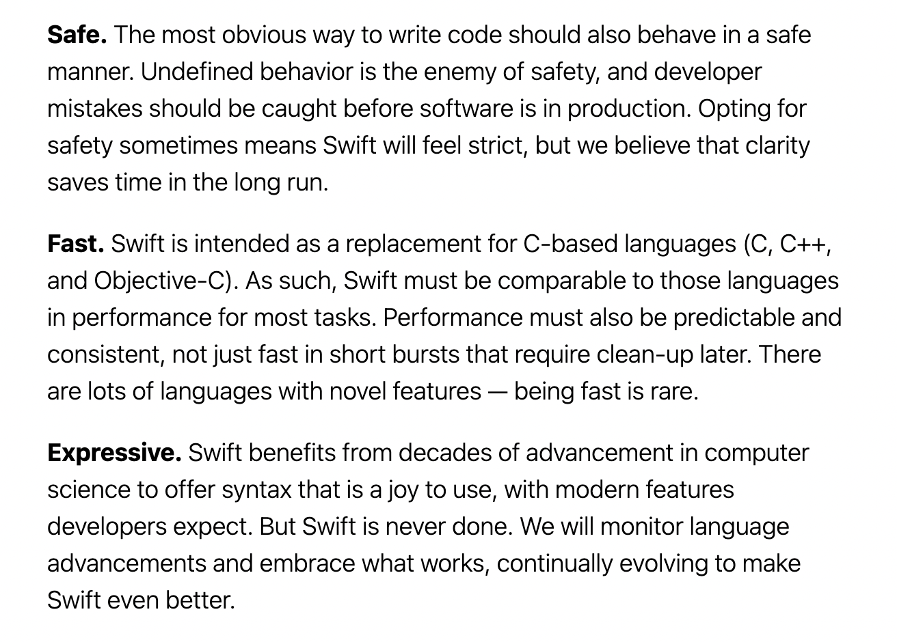

# Swift

### swift 에 대해 알아보자

Swift 는 오픈소스다. 크로스 플랫폼을 지원하며, Linux를 비롯한 모든 애플 플랫폼을 지원한다. 애플 플랫폼 뿐만 아니라 서버 응용 프로그램에도 사용된다.

#### Swift 의 목표?
Swift의 목표는 **시스템 프로그래밍, 모바일 앱에서 데스크탑 앱, 그리고 클라우드 서비스**까지 사용할 수 있는 최적의 언어가 되는 것이다.

가장 중요한 것은 개발자들이 올바르고, 쉽게 코드를 작성할 수 있도록 하는 것이다. 이러한 목표를 위해 Swift 는 아래의 특징을 갖는다.

### Swift 의 특징
- https://www.swift.org/about/
위의 문서의 문서를 보면 Swift 를 세 가지 특징으로 설명한다.


 ### 1. Safe
Swift 는 안전한 프로그래밍을 지향한다. 개발 중 프로그래머가 할 수 있는 실수를 엄격한 문법을 통해 방지한다.
 guard 문, if let 문, 옵셔널 등을 통해 옵셔널이 아닌 변수에는 절대 ```nil``` 값이 할당 될 수 없도록 통제한다.

 - #### Swift 는 컴파일 언어
 Swift 는 **컴파일 언어**로써, 컴파일 시에 이러한 불안정성을 검사해 런타임 시 발생할 수 있는 오류를 사전에 방지한다.

#### 2. Fast
Swift 는 C 기반 언어 Object-c 등과 같은 언어를 대체하기 위해 작성된 언어다.
실행 속도의 최적화와 컴파일러를 지속적으로 발전시키고 더 빠른 컴파일 성능을 구현하고 있다.

#### 3. Expressive
개발자들이 사용하기 좋은 문법과 최신 기능을 제공한다.