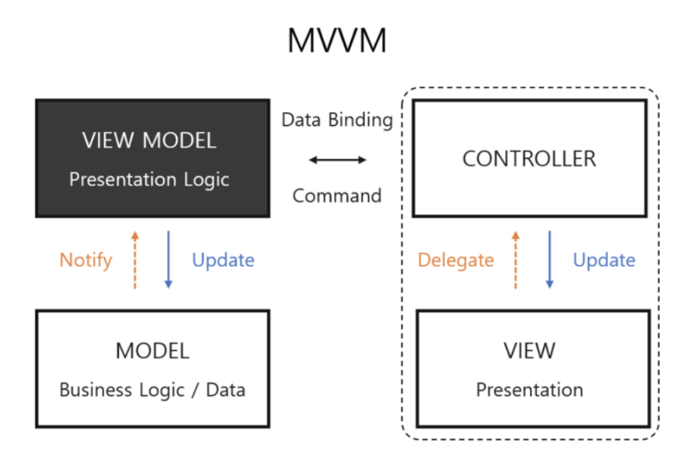

# MVVM(Model - View - ViewModel)

## 'M'VVM 의 Model
MVVM 아키텍쳐에서 Mdel은 <b>데이터 구조를 정의</b>하고 ```ViewModel``` 에게 <b>결과를 알려준다.</b>
여기서의 Model 은 View 와 이어지지 않는다.

## M'V'VM 의 View 
MVVM의 View 는 흔히 사용하는 ```ViewController``` 에 코드를 작성한다.
View 는 사용자와의 상호작용을 통해 이벤트가 일어나게 되면 <b>ViewModel 에게 알려주고, ViewModel이 업데이트 요청한 데이터를 보여준다.</b>

## MV'VM' 의 ViewModel
ViewModel 은 사용자의 상호작용 view 가 보내주면 그에 맞는 이벤트 처리를 하고,
 Model의 Read, Update,  Delete 를 담당한다.



기존의 view 는 단순히 유저 인터페이스를 표시하기 위한 로직을 담당하고, 그 외에는 메소드 호출 정도만 있는게 이상적인데, 
```ViewModel``` 은 <b>기존 UIKit을 import 할 필요도 없이 데이터 업데이트 및 뷰 요소를 업데이트 한다.</b>


## 장점
- View - Model - ViewModel 모두 독립적으로 테스트가 가능하다.

## 단점 
- 설계가 어렵고, 뷰에 대한 처리가 복잡해지면 ViewModel 도 거대해진다.


 #### 참고
 - https://42kchoi.tistory.com/292