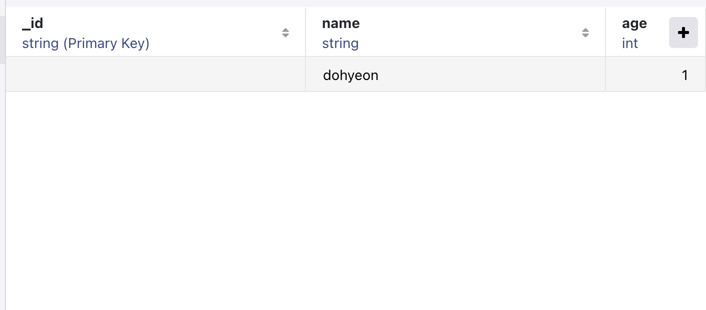

# Realm 이란?
<b>오픈소스로 제공되는 모바일 데이터베이스 관리 라이브러리이다.</b>

--- 
# RealmSwift

RealmSwift 를 Add Packgae 했다면 파일에서 import 해서 쓰면된다.

우선 Realm 상에서 저장할 객체 클래스를 생성한다.
여기서 주의할 점은 Realm 에서 Column 형태로 사용하려면, ```@Persisted```키워드를 붙여줘야 한다.


####  적용하기

https://github.com/realm/realm-swift.git

Up to Next Major 로 선택하고 최소 버전은 ```10.19.0```으로 해주면 된다!

그리고 Add Package 하면 된다.


### MongoDB Realm Studio

Open Realm file 을 클릭하고 현재 RealmSwift 를 사용하고 있는 파일의 경로를 찾아야 한다.

### 경로를 찾기 위해선?
코드상에서

```swift
.onAppear {
    print(Realm.Configuration.defaultConfiguration.fileURL!)
}
```
```Realm.Configuration.defaultConfiguration.fileURL!``` 이 키워드를 print 해주면 경로를 알려준다.

위의 코드로 경로를 얻고
 그 경로를 finder 에서 ```command``` + ```shift``` + ```g``` 를 눌러서 복붙 해주면 해당하는 MongoDB Realm Studio 를 열 수 있다!



