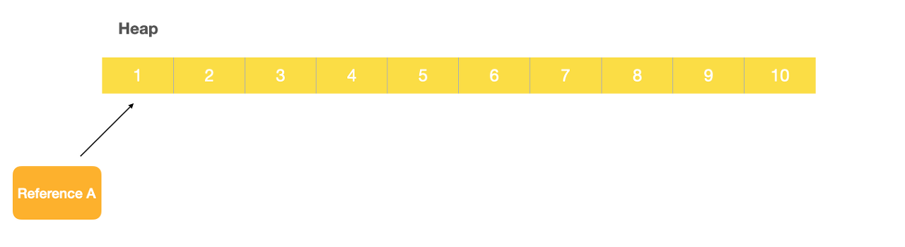
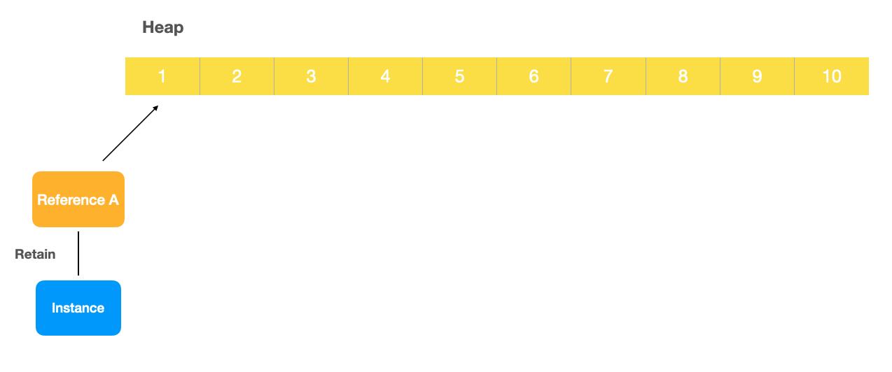
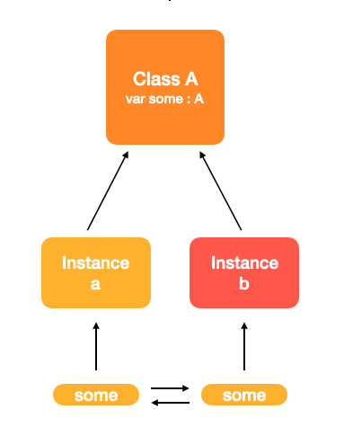
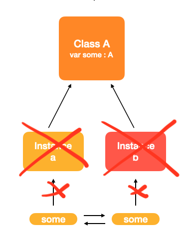

# Retain Cycle
- 메모리가 해제되기 않고 유지되어 누수가 생기는 현상을 말한다.

클래스간 참조는 default로 강한(strong) 참조 이기 때문에 각각의 클래스에서 참조가 발생한다면 강한 참조로 인해 <b>메모리에서 해제되어야 할 상황에서도 해제되지 않는 현상이 발생한다.</b>
이것은 <b>메모리 누수(Memory Leak)</b>로 이어지게 된다.

### 참조하는 값은 메모리의 어떤 부분에 해당될까?
바로 <b>Heap</b> 이라는 영역에 해당된다.

<b>Heap</b> 이라는 영역에 메모리가 저장되기 위해서는 한 공간이 필요한데, 바로 그 공간을 레퍼런스가 바라보고 있는 것이다.



### Retain 이란?
먼저 <b>Retain</b> 이란 위 사진과 같이 메모리를 차지하고 있는 레퍼런스를 이용해서 인스턴스를 만들었을 때 생겨난다.

A를 클래스라고 가정하고 "let instance = A()" 라고 만들어 주는 것이 <b>retain</b> 되는 것이다.



이렇게 만들어진 인스턴스는 default 로 강한(strong) 참조로 연결되어 있다.

만약 인스턴스 안에 있는 무언가가 다른 인스턴스와 연결될 때 문제가 생긴다.

<br>
예시로 A라는 클래스 안에 A 타입을 가진 some 이라는 변수가 있다고 가정해보자.
```swift
class A {
    var some : A?
}
```

그리고 A 를 참조하는 a 라는 인스턴스와 b 라는 인스턴스가 있다.
```swift
var a : A()
var B : A()
```

이때 a 안에 있는 some 이 b 가 되고, b 안에 있는 some 이 a 가 된다면 어떻게 될까?
```swift
a.some = b
b.some = a
```

아래처럼 연결되게 된다.



여기서 만약 인스턴스들이 nil 이 된다면 어떻게 될까?

아래와 같이 인스턴스들이 nil 이 되면서 프로퍼티였던 some과 some 이 남게 된다.

이미 인스턴스들이 nil 이 되었기 떄문에, 프로퍼티끼리 연결된 것들은 영원히 해제되지 않고 남아있게 된다.

이것이 쓸모없는 데이터가 되고, 메모리 누수를 발생시키는 것이다.



이렇게 메모리 누수를 방지하기 위해 상황에 맞게 ```strong, weak, unowned``` 를 이용해서 강하게 연결할지 약하게 연결할지를 결정해야 한다.

### 메모리 누수는 어떻게 찾을까?
메모리가 해제될 때 deinit() 메서드가 호출되기 떄문에 해당 메서드를 통해서 찾을 수 있다.

```swift
deinit {
    print("deinit ...")
}
```

#### 참고
https://fomaios.tistory.com/entry/iOS-%EB%A9%B4%EC%A0%91%EC%A7%88%EB%AC%B8-Retain-Cycle%EC%9D%B4%EB%9E%80