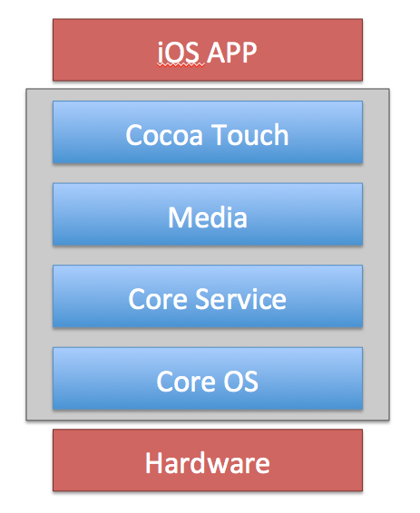

# iOS 의 계층구조

- Core OS
- Core Serviece
- Media
- Cocoa Touch

하위 계층은 iOS 의 핵심 부분 또는 하드웨어에 가까운 기능을 가지고 있다.

<b>아래로 갈수록 iOS의 핵심, 하드웨어 관련 이고, 위로 갈수록 사용자와 관련이 있다.</b>

## Core OS
- 하드웨어와 가장 가까이 있는 최하위 계층이다.
- iOS 의 거의 모든 기능의 기본적적인 부분을 관리한다.
- C기반의 저수준의 API 로 이루어져 있다.
- 데이터 처리, 네트워크, 파일 접근 등 시스템의 핵심적인 기능을 포함한다.

## Core Service
- Core OS 에서 제공하지 않는 기능을 포함하고 있다.
- 내부 데이터 / 위치 / 센서 등의 기능을 제공한다.
- CoreMotion(기기 센서), Accounts(계정 관리), Foundation(데이터 관리) 등의 기능을 제공한다.

## Media
- 그래픽, 비디오, 오디오 등 멀티미디어 기능을 제공한다.
- C 와 Object-C 가 혼합되어있는 형태이다.
- AvFoundation(미디어 재생관련), MediaPlayer(플레이어), Core Image(이미지 가공) 등의 기능이 있다.

#### 참고
- https://brody.tistory.com/106
- https://iamcho2.github.io/2021/06/12/architecture-of-iOS